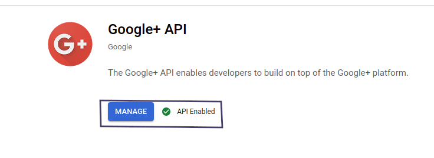
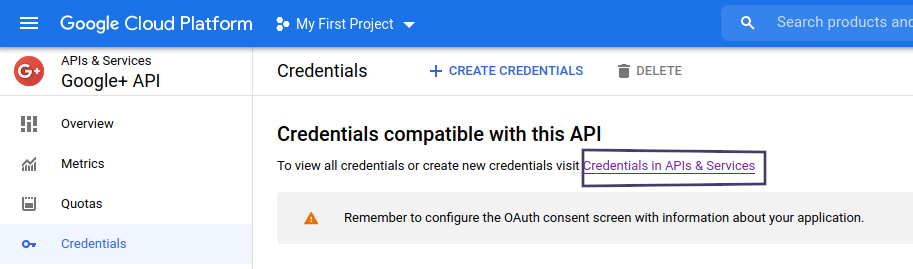
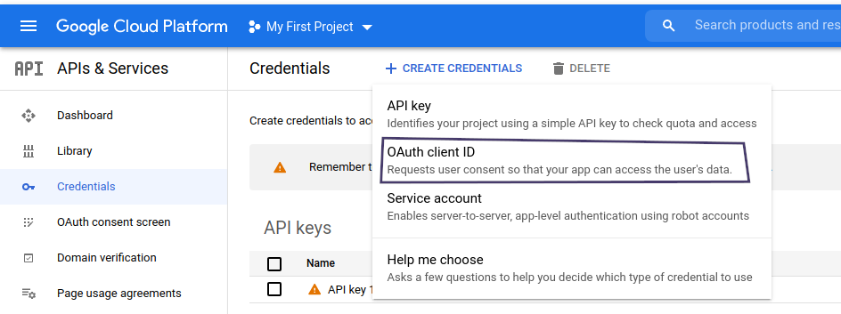
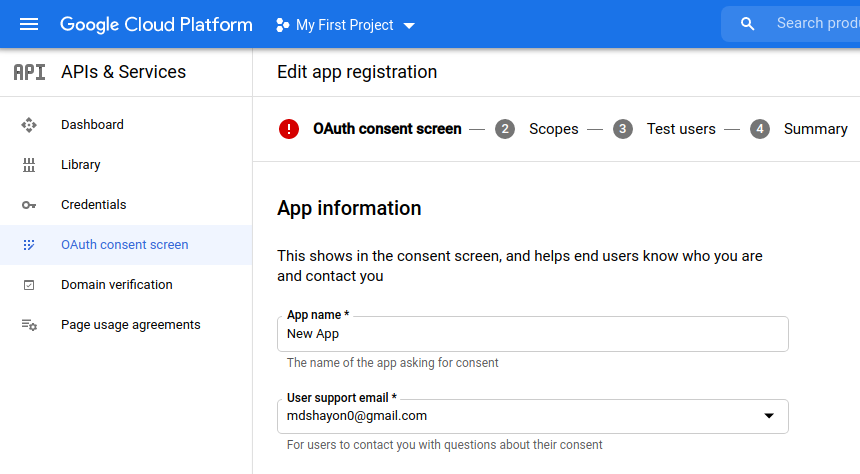
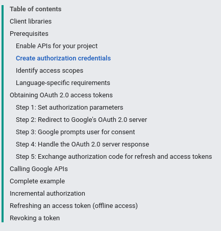

# Google OAuth

 - [Tutorial](https://www.youtube.com/watch?v=SBvmnHTQIPY&t=7845s)
 - Install all types of dependicies for this project

 ```
 npm install express mongoose connect-mongo express-session express-handlebars dotenv method-override moment morgan passport passport-google-oauth20
 ```
 

 ```
npm install -D nodemon cross-env
 ```

 - Enable **Google+ API** from [here](https://console.cloud.google.com/apis/api/plus.googleapis.com/overview?project=neon-radius-300702)

    

 - To view all credentials or create new credentials visit [Credentials in APIs & Services}(https://console.cloud.google.com/apis/api/plus.googleapis.com/credentials?project=neon-radius-300702)

    

 - Create OAuth consent screen -> Make everything default

    

    

 - Create credentials -> oauth client id -> [know more](https://developers.google.com/identity/protocols/oauth2/web-server)

    

 - **URIs** will be __http://localhost:3000/auth/google/callback__
 - 