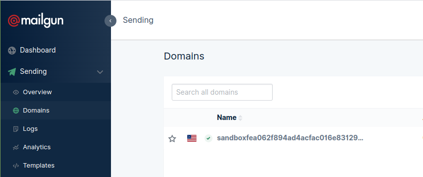
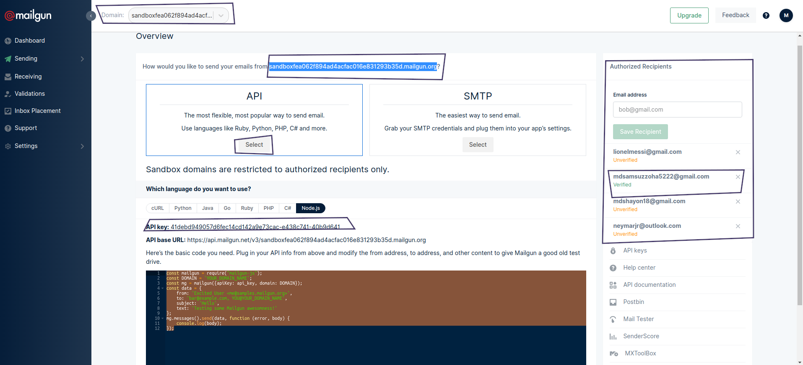
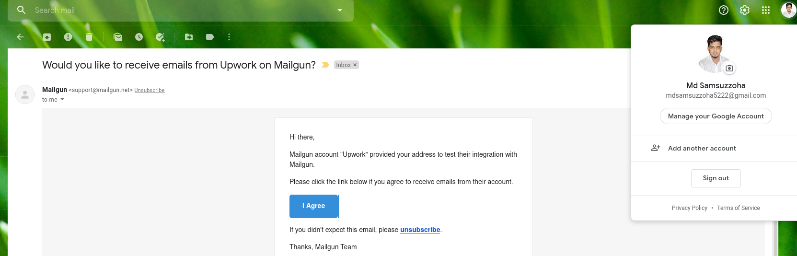
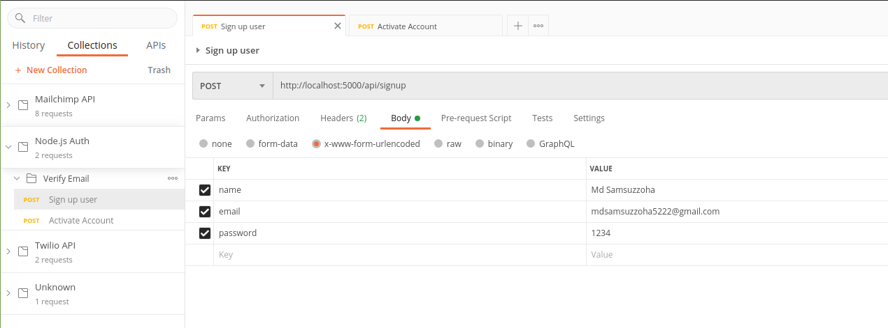
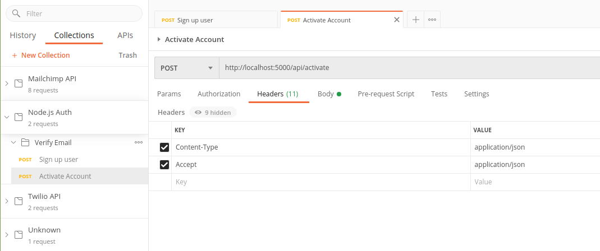
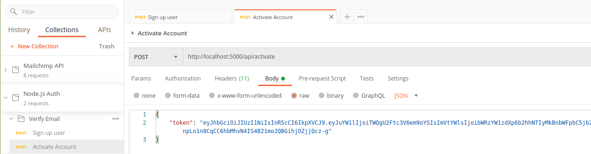

# Email Verify

[Tutorial](https://www.youtube.com/watch?v=CEim3tZsp1Y&t=744s)

### Mailgun

 - For sending email -> from sidebar go to sending -> for free account we will have one domain

  

 - Click on domain and you can the api -> to send email to recipant need to verify via email 

  

  

 - All requests from postman

  

  

  