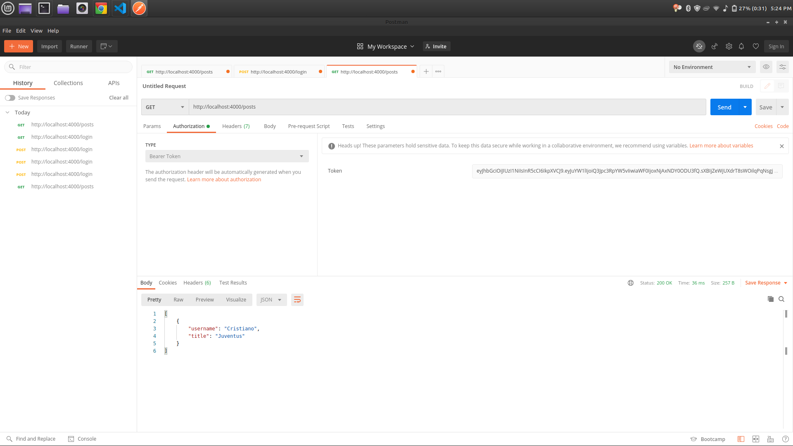
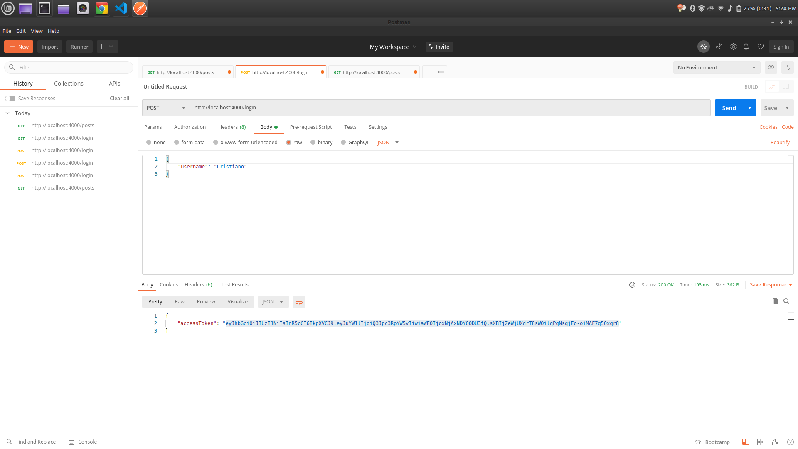

# JWT Authentication

[Tutorial](https://www.youtube.com/watch?v=mbsmsi7l3r4)

### Creating random bytes as hex

 - on terminal use node shell
 
 ```
 require('crypto').randomBytes(64).toString('hex')
 ```

 ### Sending client request though postman

  - Before making any request make sure both server is running (index.js and authServer.js)

  - Get request for all post

  

  - Post request to get access token for single user

  

  - Get request for authorization bearer token to see the post which is visible for varified user

  

  - Post request to get access token for single user wwith token and refresh token

  

  - Get request from another server to get access token for single user

  
